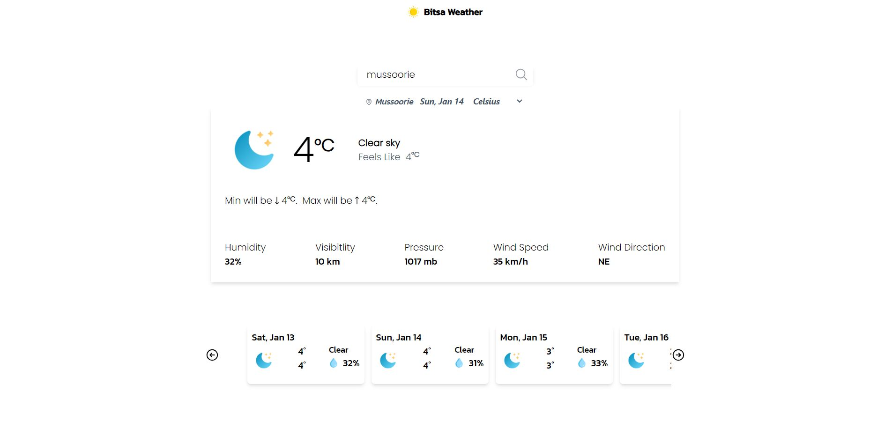
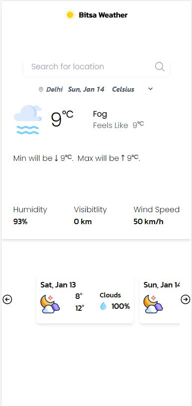

# Live Link:
https://weatherapp-aor0.onrender.com/

# Inro
The app was built as an assignment for MirrAR.

# Weather App
A simple weather application that allows users to get the current weather and a 5-day forecast for a chosen location. The application uses data from the OpenWeather API for weather information and the GEOdb API for city suggestions.

## Features
- Get current weather information, including temperature, humidity, wind speed, and more.
- View a 5-day weather forecast with details like temperature, weather conditions, and humidity.
- Search for cities to get weather information.

## Technologies Used
- React: A JavaScript library for building user interfaces.
- Redux: A state management library for managing the application's state.
- Tailwind CSS: A utility-first CSS framework for styling.
- OpenWeather API: Provides weather data for various locations.
- GEOdb API: Provides city suggestions based on user input.

## Getting Started

1. Clone the repository:

   ```bash
   git clone https://github.com/yash1997verma/WeatherApp
   weather-app.git
2. Configure API Keys:
    Obtain API keys from OpenWeather and GEOdb.

    Create a .env file in the project root and add the API keys:
    ```bash
    REACT_APP_WEATHER_KEY=your_openweather_api_key
    REACT_APP_GEODB_CITIES=your_geodb_api_key


3. Run the application: 
    ```bash
    npm start

# Usage
-   Enter a city name in the search bar to get   current weather and forecast information.
-   Select the preferred temperature unit (Celsius or Fahrenheit).
-   Explore the weather details for the chosen location.


**Screenshots**

   

   -*Full Screen* 
   
     

   -*Mobile*
   